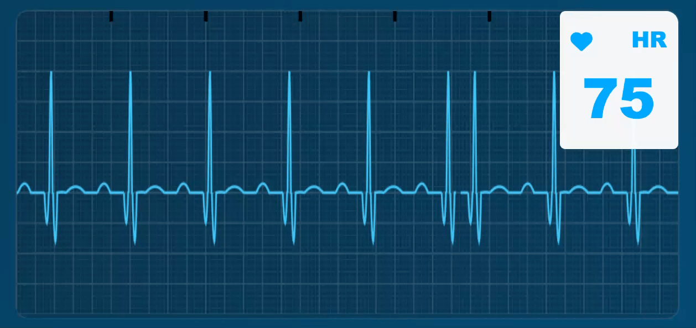
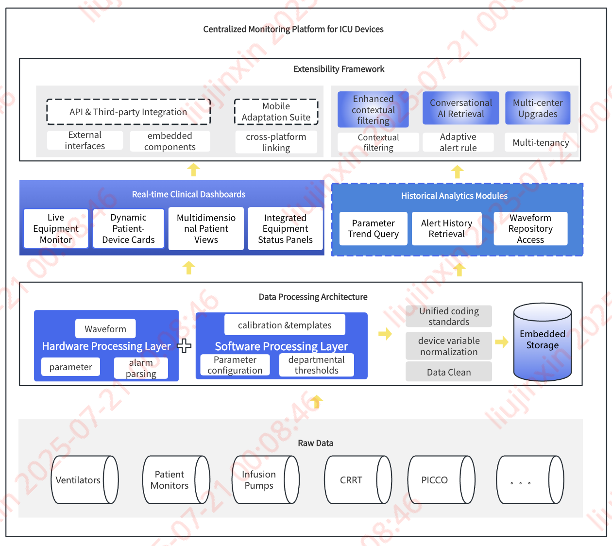
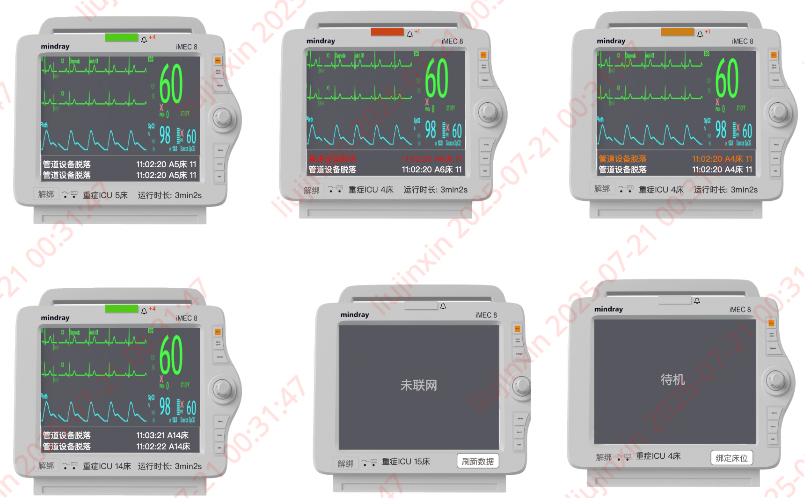

**Comprehensive Centralized Monitoring Platform for Critical Care Medical Equipment**

This product serves as an integrated platform for the centralized, real-time monitoring of critical care medical devices, including ventilators, patient monitors, infusion pumps, and related equipment. Beyond tracking fundamental parameters, the system comprehensively captures messages, waveforms, alarm signals, and other critical data streams, establishing itself as a holistic solution for consolidated equipment surveillance in intensive care settings.

**Background:**

1. The Intensive Care Unit (ICU) epitomizes a capital-intensive department, distinguished by substantial investments in sophisticated medical apparatus, extensively employed to sustain patients' vital signs and ensure circulatory stability. For instance, approximately 90% of ICU patients necessitate ventilator support, with individual units commanding prices in the hundreds of thousands; ancillary devices such as hemodialysis machines, PICCO monitors, and CRRT systems are similarly indispensable.
2. This unit operates as a data-centric environment, demanding meticulous documentation of copious monitoring metrics, nursing details, medication logs, procedural entries, and crucially, patient status updates. Neglect in this domain can precipitate deterioration, potentially escalating to infections like sepsis, which readily advances to multiple organ failure and exacerbation.
3. In this era dominated by artificial intelligence, data assumes paramount significance, particularly real-time monitoring streams synchronized with hospitalized individuals—pristine, efficient, and of superior quality—adeptly harnessed for model inference and predictive analytics. For example:
   * Ventilator waveforms (a reference elucidating their interpretations is available at 🔗<https://ecg-sim.web.app/>); during clinical shifts, pertinent waveform data may manifest on these devices;
   * Specific research endeavors can leverage such specialized real-time waveforms and high-density parameter metrics to pioneer novel diagnostic and therapeutic paradigms.

**Challenges:**

1. Proliferation of Equipment Models: A diversity of respiratory apparatus types and protocols exists; numerous devices permit only rudimentary data acquisition, while others remain entirely uncooperative, yielding no output.
2. Waveform Acquisition and Rendering: Delays in waveform capture challenge system performance; rendering entails not mere line sketching but accurate and appropriate depiction, necessitating coefficient-based transformations for precise plotting.
3. Inadequate Parsing: Despite devices enabling data accessibility, requisite parsing vendors must accurately interpret waveforms, parameters, and messages; accumulation of pertinent plugins is imperative.

**Market Competitors:**

1. Limited Parameter Parsing: Capable of acquiring only a scant few parameters, with certain device types remaining entirely uninterpretable.
2. Scarce Vendor Compatibility: Data acquisition is confined to a limited array of device manufacturers, rendering others inaccessible in a specific manner.
3. Insufficient Setting Parsing: Incapable of gathering device-specific configuration values, as individual units may adjust parameters per patient age or status; faithful replication of displays necessitates direct access to settings for alignment with color-coded information—a domain where prevailing solutions typically falter.
4. Restricted Parsing Modalities: Support solely network port interfaces, eschewing alternative methodologies, thus failing to efficiently harvest data from diverse ports such as 24-pin or 32-pin configurations.

### Key Features

* **Unified Real-Time Oversight**: Simultaneously monitors ventilators, monitors, infusion pumps, and other vital devices across the ICU.

* **Multidimensional Data Capture**: Acquires not only numerical parameters but also contextual messages, dynamic waveforms, and prioritized alarm notifications.
* **Comprehensive Analytics Hub**: Functions as an all-encompassing platform for aggregating, visualizing, and interpreting device-generated intelligence.
* **Clinical Insight Enhancement**: Transforms disparate equipment outputs into coherent, actionable insights for clinical decision-making.

### Technical Highlights

* **Cross-Device Integration**: Seamlessly interfaces with heterogeneous devices through adaptive protocol support.

* **High-Fidelity Waveform Processing**: Ensures precise acquisition and artifact-free rendering of complex physiological waveforms.
* **Intelligent Alert Triage**: Implements context-aware prioritization of alarms to mitigate notification fatigue.
* **Scalable Data Architecture**: Facilitates secure, low-latency data streaming for enterprise-level deployment.

This platform redefines critical care instrumentation management by converging fragmented device data into a unified operational panorama, empowering clinical teams with unprecedented situational awareness.

**Key Breakthroughs:**

1. **Real-time Waveform Visualization**: Dynamically displays waveform data synchronized with patient profiles while preserving comprehensive granular records for subsequent analysis and application.
2. **Instantaneous Device Alert Integration**: Critical equipment alarms and notifications—inaccessible to physicians during physical absence—are systematically parsed and stored, enabling retrospective clinical evaluation of patient conditions and device alerts.
3. **Automated Multi-tiered Alert Generation**: Context-aware messages are autonomously triggered based on customized thresholds (normal/abnormal/critical ranges) tailored to patient conditions and departmental protocols.
4. **Versatile Data Acquisition Modalities**: Incorporates wired/wireless network collection, IoT gateway interfaces, and compatibility with 24-pin/32-pin ports.
5. **Configurable Product Architecture**:
   * Supports customizable visualization schemes and clinical alert taxonomies
   * Enables department/enterprise-level interface personalization
   * Facilitates patient-specific parameter configurations across institutional hierarchies

This framework transforms raw device outputs into stratified clinical intelligence through adaptive data orchestration and user-defined alert hierarchies.

**Functional Specifications:**

| Feature Category | Submodule              | Description                                                                 |
|------------------|------------------------|-----------------------------------------------------------------------------|
| **Dashboard**    | Equipment Overview     | Displays aggregated device status across authorized units                   |
|                  | Notification Center    | Centralized alert management interface                                      |
|                  | Operational Metrics    | Monitors server performance, storage efficiency, exception tracking, and interface anomalies |
|                  | 3D Equipment Mapping   | Visualizes device locations across departments via interactive 3D modeling  |
|                  | Anomaly Analytics      | Real-time tracking of equipment alarms, communication logs, and critical warnings |
| **Realtime**     | Device Monitor         | Card-based display of real-time parameters, waveforms, and alerts with filtering capabilities |
|                  | Patient-Device Matrix  | Customizable bedside view showing patient vitals, multi-device waveforms, and condition-specific alerts per department protocol |
|                  | Configurable Waveform Views | Custom multi-device waveform displays with user-defined layouts, parameters, and visualization schemes |
|                  | Multi-system Patient View | Synchronized monitoring of circulatory variables and concurrent device data streams for active treatments |
|                  | Intelligent Alert Console | Hierarchical alarm presentation integrating device-generated alerts with patient/department/institution-level threshold breaches |
| **Historical**   | Device Query           | Retrospective analysis of device settings, parameters, waveforms, native messages, and triggered alerts |
|                  | Patient Timeline       | Comprehensive historical records across all devices ever associated with a patient |
| **Configuration**| Role-based Access      | Granular permission settings by user and functional scope                   |
|                  | Authorization Profiles | Menu access control through customizable role assignments                  |
|                  | Audit Logs             | Centralized logging of user actions, automated device events, and critical system activities |
|                  | Departmental Scope     | Multi-department dictionary management with activation controls              |
|                  | Clinical Dictionaries  | Configurable templates for thresholds, parameters, waveform zones, parsing frequencies, device types, and alert ranges |
|                  | Multi-device UI        | Adaptive interfaces for tablets, large displays, and multi-chain screens    |
| **Extensions**   | Data Standardization   | Unified Medical Data Management (MDM) frameworks with message categorization, waveform parsing taxonomies, setting interpretations, and composite conditional queries |
|                  | AI Integration         | 1. Ventilator waveform analysis with knowledge base-driven alerts  2. Historical parameter optimization via monitor-patient context matching  3. NLQ-enabled search across parameters, messages, and waveform segments |
|                  | Multi-institutional Scalability | Cross-organization monitoring permissions with secure data exchange, scope-limited sharing, encryption, and anonymization protocols |

*Note: Structured to maintain hierarchical relationships while optimizing technical precision and clinical relevance.*
