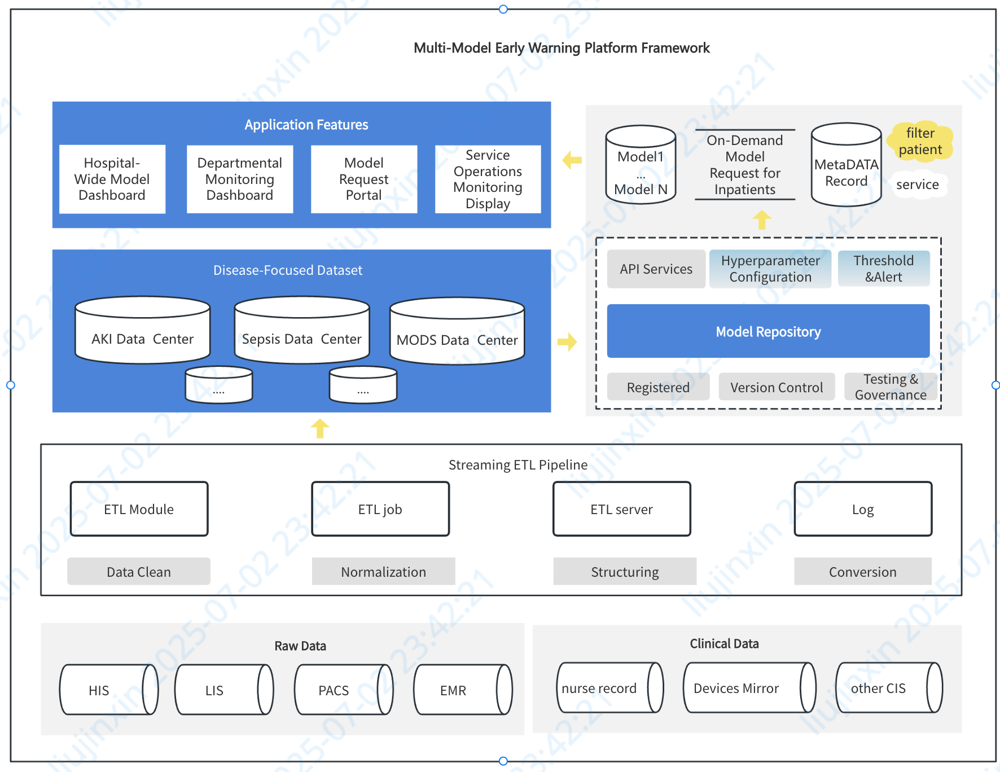

## Target

This implementation establishes a multi-model integrated platform for real-time patient risk surveillance, enabling continuous assessment of critical conditions through unified computational frameworks.

## Background

**Clinical Pain Point Analysis**  
Critical care units manage high-acuity patients with unpredictable deterioration, requiring intensive monitoring that consumes 68% of nursing time (per JCAHO benchmarks). However, prevailing nurse-to-patient ratios of 1:1.5 fall below recommended standards of 1:3-1:5, creating significant safety gaps in risk response capabilities.

**Model Management Challenges**  
Existing model deployments face three core challenges:

a) Validation Fragility
Static models lacking continuous data ingestion fail persistent clinical validation (per FDA SaMD guidelines)

b) Dataset Fragmentation
Disparate variable requirements force redundant data provisioning, hindering hospital-wide data asset consolidation

c) Research Silos
Proliferation of single-study models (67% being pilot academic projects) creates operational complexity"*

### Breakthroughs

1. **Innovative Model Repository Management:** Establishes a unified repository for diverse model types, enabling dedicated model management capabilities including **debugging, administration, configuration, and validation.** Crucially, the system **automatically selects and applies the highest-risk model** based on individual patient profiles for optimal clinical relevance.
2. **Multi-dimensional Model Visualization:** Effectively presents models across various dimensions. This includes, but is not limited to, **temporal (time-series) and non-temporal models,** visualization of **model parameter evolution history,** and **integrated displays combining model outputs with critical patient information** for comprehensive clinical insight.
3. **Granular Access Control & Alert Optimization:** Implements **role-based access controls (RBAC) for patient data visibility** combined with **configurable data permissions (e.g., anonymization protocols).** This enables **customizable, tiered alert management,** effectively **mitigating clinical alert fatigue** caused by an overload of low-priority notifications through tailored, risk-based alerting strategies.

### Implementation Strategy

1. **Foundation: Real-time & Historical Patient Data Hub:** Provides a **core platform for collecting and managing standardized, general patient datasets.** This platform **integrates real-time data from current inpatients with comprehensive historical patient records** to form a robust data foundation.
2. **Centralized Model Repository Framework:** Implements a **comprehensive model registry mechanism.** This supports **model registration, version control, threshold configuration, hyperparameter tuning,** and essential lifecycle management tasks within the unified repository.
3. **Robust Data Governance & Access Control:** Establishes **granular data permissions and strict data isolation protocols.** Data is **tagged and segmented** based on criteria like **department, ward, and disease type.** This segmentation is **tightly integrated with the RBAC system,** enabling highly **flexible and secure foundational configurations** tailored to organizational structure and needs.

### Future Outlook

1. **Data as Strategic Digital Assets:** High-quality, curated datasets evolve into **valuable organizational digital assets,** paving the way for **systematic digital asset management and potential value exchange mechanisms** within or between trusted entities.
2. **Model Reusability & Cost Efficiency:** High-performance models trained on these assets become **readily reusable resources.** This enables **cross-organizational deployment and adaptation,** significantly **reducing development costs and accelerating implementation** for similar clinical needs elsewhere.
3. **API-Driven Open Ecosystem & Collaboration:** The internal model training and management infrastructure will be **exposed via secure, integrated API services.** This openness **facilitates access for external partners and institutions,** fostering **multi-center collaboration, regional health information exchange, and a shared ecosystem for AI-driven healthcare innovation.**

---

## Product Feature List

| Level 1            | Level 2               | Function Description (EN)                                                                                                |
| :----------------- | :-------------------- | :---------------------------------------------------------------------------------------------------------------------- |
| **Dashboard Apps** | **Hospital Command Center** | Displays hospital-wide alerts: Shows all patients flagged by risk models across the facility.                          |
|                    | **Department View**     | Visualizes active patient alerts within a specific department. Configurable to display only high-priority alerts.        |
|                    | **Patient Detail View** | Shows detailed model results for a specific patient: Model history, request parameters, variable trends & anomalies, flagged outcomes. |
|                    | **Dashboard Configuration** | Configures model display scope, alert severity levels, and display order.                                             |
| **Model Repository** | **Model Registration**   | Manages model metadata, categorization, and file uploads/storage.                                                     |
|                    | **Threshold Settings**   | Configures model risk thresholds, severity levels, and applicable disease mappings.                                   |
|                    | **Departmental Rules**   | Sets department-specific alert rules: Message priority, notification level, and display order for models.               |
|                    | **Version Control**      | Manages model lifecycle: Upload, download, publish, edit, categorize. Maintains full audit trail.                     |
|                    | **API Management**       | Visualizes model parameters & provides API testing tools. Supports batch testing. Facilitates secure API access & management. |
| **Model Ops Dashboard** | **Request Summary**      | Overview of model operations: Aggregated request metrics (success/fail rates, rejection reasons).                     |
|                    | **Alert Details**        | Detailed model alerts: Content messages, diagnostic logs, hyperparameter shifts, raw vs. transformed value alerts.     |
| **Disease-Specific Dataset Mgmt** | **Dept/Hospital Summary** | Visualizes disease-specific data collection metrics by dept/hospital: Cohort enrollment, follow-up status, API call volume. |
|                    | **Cohort Criteria**      | Defines & manages patient inclusion/exclusion rules for studies (based on encounter data for standard models).         |
|                    | **Variable Definition**  | Defines variable domains, individual variables, and data transformation rules.                                         |
|                    | **Variable Generation**  | Configures variable calculation: Request frequency, update logic (incremental/full), patient-encounter level precision. |
|                    | **Data Warehouse**       | Displays details of generated variables. Extensible to include follow-up data collection.                              |
|                    | **Dataset Management**   | Manages multi-version datasets. Extract data directly from warehouse. Merge test datasets. Use interactive Venn diagrams for cohort partitioning. Supports data cleaning/editing with visualization tools. Extracts key variables for analysis. |
|                    | **Advanced Search**      | Enables filtered dataset searches (within user permissions). Supports variable aggregation, transformation, and complex queries (AND/OR/NOT). |
|                    | **Follow-Up Management** | Automated patient recruitment based on criteria. Supports post-discharge mobile follow-up entry & in-clinic QR code enrollment. Allows authorized edits to follow-up data (audited). |
|                    | **System Settings**      | Manages user roles, menu permissions, and role-based data access scopes.                                               |
