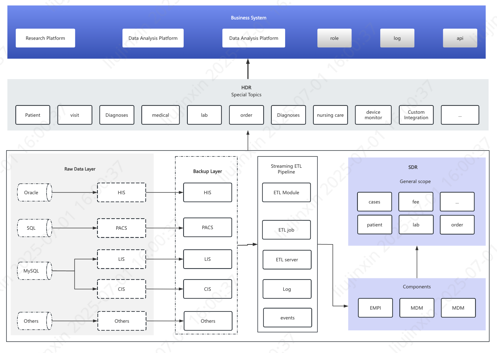
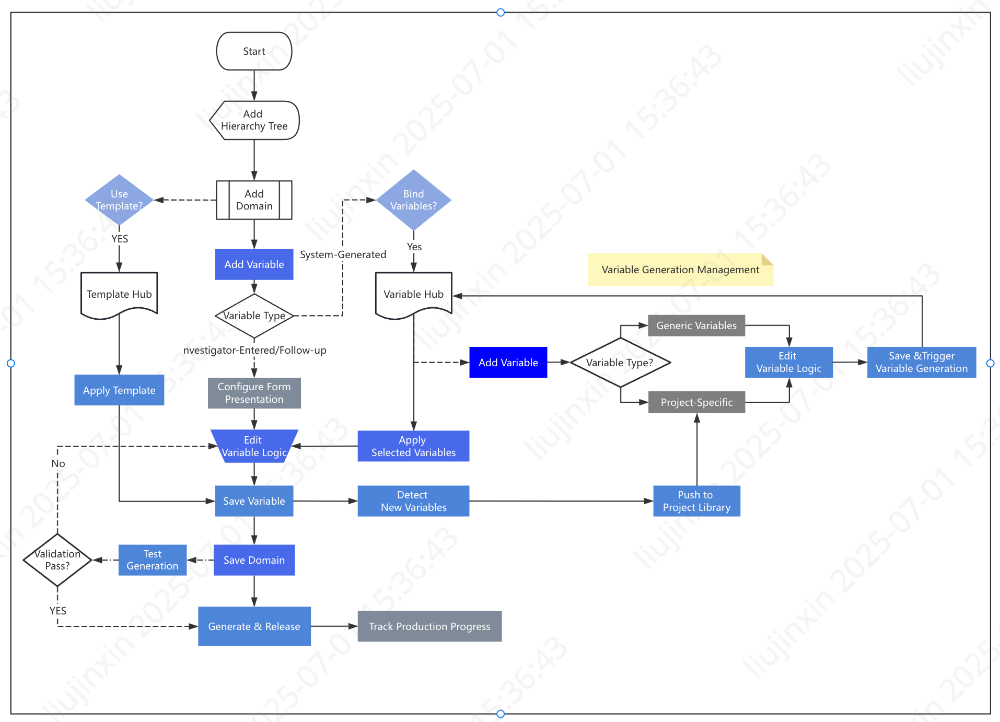
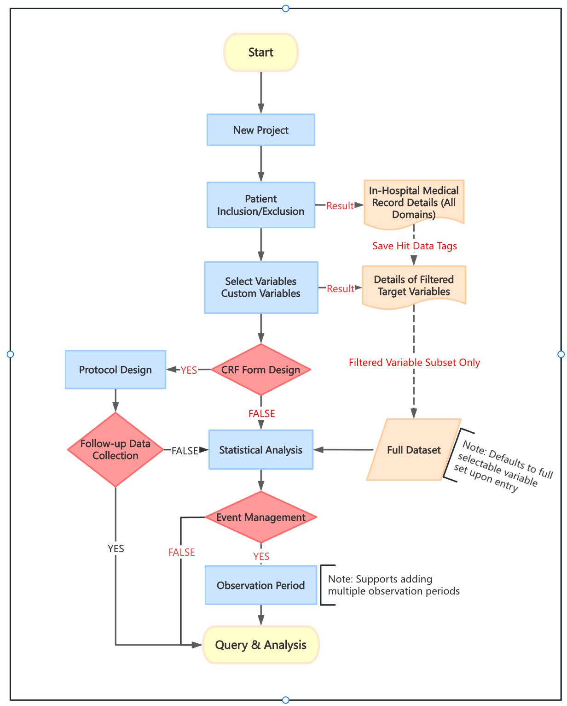
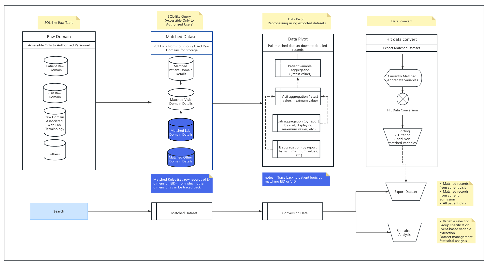
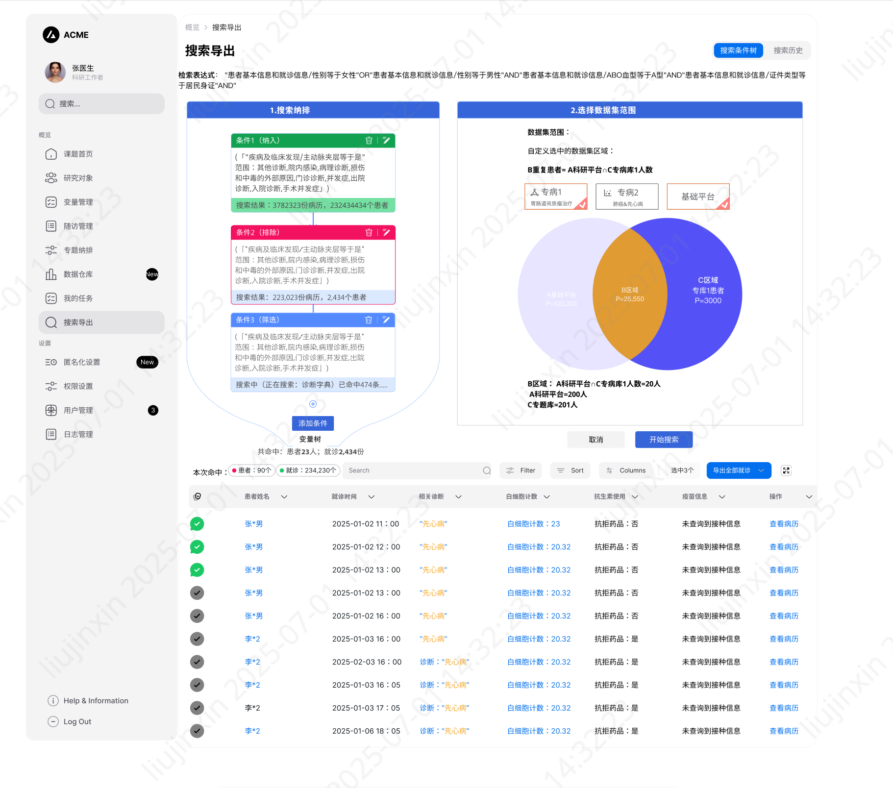

### Project and Content Description

**Project Name:**
*Specialized Upgrade Project for Research Platform's Underlying Data Middleware Adaptation to Enhance Search Accuracy*

**Project Background:**
The project has undergone 5 iterative versions, deployed across multiple hospital sites. However, ongoing maintenance revealed systemic issues:

#### I. Core Operational Challenges

1. **System Performance**
   - Slow search responses
   - Incomplete data exports
   - Cumbersome project creation workflows
2. **Variable Generation Management**
   - Unclear and chaotic underlying variable generation steps
   - Difficulties in monitoring workflows
3. **Design Inconsistency**
   - Lack of unified design language
   - Excessive redundant content

#### II. Product-Market Mismatch

1. **Expectation Gap**
   - Strong marketing appeal and user recognition of product concepts
   - Significant discrepancies between promised features and actual user experience
2. **Competitive Disadvantage**
   - Requirement for high-cost customizations to match competitor benchmarks
   - Low ROI leading to sales team reluctance in pursuing deals
   - Market intelligence deficiencies regarding key competitors

---

### Project Objectives

1. **Competitiveness Enhancement**
   - Resolve existing system flaws through actionable solutions
2. **Feature Parity**
   - Close functional and parametric gaps against competitors
3. **Differentiated Value Proposition**
   - Execute holistic product upgrades to establish unique market positioning

---

### Project Analysis

#### I. Core Functional Issues

1. **Slow Search Performance**
   - *Example*: Query "Patients diagnosed with congenital heart disease (CHD) from 2015 to present with white blood cell count ≥2" returned 22,345 patients in **1 min 42 sec** on our system.
   - *Competitor Benchmark*: Similar query took **~1 min 10 sec** for 20,344 patients.

2. **Incomplete Search Results**
   - *Critical Gap*: Standardized queries fail to capture synonym variations (e.g., "CHD" = "Congenital Heart Defect" | "Congenital Cardiovascular Anomaly").
   - *Impact*: Users must manually combine multiple diagnostic definitions.

3. **Abnormal Data Export Formats**
   - *Key Issues*:
     - Column mismatches preventing direct import into SPSS/R
     - Truncated datasets requiring repeated export requests
     - Mandatory security approvals delaying data access

4. **Subproject Creation Challenges**
   - *Pain Points*:
     - Complex inclusion/exclusion criteria adjustment
     - Statistically demanding design processes
     - Low user adoption due to steep learning curve

5. **Missing Custom Query Capabilities**
   - *Critical Unmet Need*: Inability to implement:
     - Search-triggered events
     - Variable-driven workflows
     - Custom extraction rules

---

#### II. Architectural Deficiencies

1. **Fragmented Product Architecture**
   - *Problem*: Isolated modules (Platform Management / Specialty Disease DB / Infrastructure Settings) with:
     - Non-inheritable configurations
     - Duplicated search functions (e.g., specialty DB variables require separate permission sets)
   - *Cost Impact*: High maintenance and customization expenses

2. **Inconsistent Design Language**
   - *UX Failures*:
     - Disjointed interaction patterns forcing constant context switching
     - Incoherent modal dialog behaviors

3. **Chaotic Permission Design**
   - *Example*: Users with specialty DB access still require additional approvals for:
     - Cross-database searches
     - Subproject creation
     - Data exports

4. **Third-Party Variable Generation Dependency**
   - *Systemic Risk*:
     - Unauditable core logic in variable management
     - Frequent ID binding failures and undetected data loss

---

### Project Plan

**Vision:** *Productize solutions through component-based development to resolve core issues, bridge functional gaps, and establish competitive differentiation.*

**Key Deliverables:**

1. **Business Scope Segmentation**
   - Map high-impact scenarios (e.g., complex cohort searches)
2. **Priority-Driven Sprint Planning**
   - Assign cross-functional teams to:
     - Search engine optimization
     - Unified variable generation workflow
     - Permission architecture redesign
3. **Modular Development**
   - Build reusable components (e.g., standardized export adapter)
4. **Integrated Functional Testing**
   - Validate end-to-end workflows (search → export → analysis)
5. **Pre-release Validation**
   - Simulate real-world usage scripts
6. **Controlled Pilot Deployment**
   - Target 3 hospital sites for phased rollout
7. **Structured Training Program**
   - Role-based certification paths
8. **Performance Monitoring Framework**
   - Track:
     - Query response latency
     - Export success rate
     - User adoption metrics

---

### Functional Specification Details

| **Tier 1 Function**       | **Tier 2 Function**         | **Functional Description**                                                                 |
|---------------------------|-----------------------------|--------------------------------------------------------------------------------------------|
| **Data Integration**      | Data Acquisition            | Connects multiple data warehouses; collects multi-source data; supports custom processing and **data masking** |
|                           | Data Cleansing              | Standardizes data using **EMPI** (Enterprise Master Patient Index) and **MDM** (Master Data Management) technologies |
|                           | Data Quality Control        | Verifies data sources/records; enforces rule-based quality checks for validity, standardization, and anonymization |
|                           | Visual Operations           | Provides integrated monitoring dashboard for data integration, collection, and quality control processes |
| **Specialty DB Management** | Specialty DB Configuration  | Defines disease criteria, **inclusion/exclusion standards**, subscription rules, disease tags, and cohort debugging |
|                           | **Variable Generation**     | Configures domain-specific variables: data sources, binding logic, input methods, display formats, synchronization, and custom calculations |
|                           | Specialty DB Dashboard      | Visualizes patient details, cohort inclusion status, core variable distributions, patient groupings, and follow-up/data filling progress |
|                           | Data Warehouse              | Displays raw collected datasets in tabular/form views; allows authorized users to edit source data |
|                           | Project & Search            | Enables authorized users to search/export data, and create subprojects |
|                           | Data QC Management          | Implements rule-based quality control: variable-level checks, security-tiered alerts, and audit trails |
|                           | Data Collection Assistant   | Automates variable-based data collection; notifies clinicians; displays collection details for verification |
|                           | Disease Follow-up           | Configures follow-up content, schedules, reminders, and closure policies |
|                           | Specialty Settings          | Manages permissions, roles, anonymization, audit logs, effective dates; controls functional access (e.g., export/view) |
| **Platform Management**   | Advanced Search             | Supports full-text/patient/conditional/event-based searches; **multithreaded search**; export capabilities |
|                           | Subproject Management       | Manages patient inclusion/exclusion, favorites, patient lists, custom follow-up plans, mobile forms, data policies, logs, anonymization. Supports **prospective/retrospective studies**. |
|                           | Research Perspective View   | Displays all integrated patient data in a unified **patient-centric view** |
|                           | Data Exploration            | Enables in-dataset cleansing (missing value imputation, text filtering, variable binning/merging/derivation), dataset versioning, variable/event management, and statistical analysis (descriptive/differential tests) |
|                           | Platform Settings           | Configures platform permissions, roles, anonymization, audit logs, external access, organizations, effective dates; controls functional access |

Notes: Key Terminology Rationale

| Chinese Term               | English Translation                   | Justification                                                                 |
|----------------------------|---------------------------------------|-------------------------------------------------------------------------------|
| 数据脱敏                  | Data Masking                          | Industry-standard privacy protection term                                     |
| 纳排标准                  | Inclusion/Exclusion Standards         | Clinical research convention                                                  |
| 变量生产                  | Variable Generation               | Consistent with prior system terminology                                      |
| 随访                      | Follow-up                             | Medical domain standard                                                       |
| 多线程搜索                | Multithreaded Search                  | Technical accuracy for parallel processing                                    |
| 前瞻性/回顾性研究         | Prospective/Retrospective Studies     | Research methodology standards                                               |
| 数据质控                  | Data Quality Control (QC)             | Maintains consistency across modules                                         |
| 科研视图                  | Research Perspective View             | Emphasizes clinical research context over literal "scientific view"           |
| 变量衍生计算              | Derived Variable Calculations         | Precise description of computational logic                                   |

---

### Simplified Data Cleansing Workflow

#### I. Process Overview

*Illustrative workflow for integrating foundational hospital data sources (HIS, LIS, PACS, CIS):*

**Step 1: Multi-Database Adaptation**
→ Extract backup **mirror repositories** from source databases

**Step 2: ETL Pipeline Execution**
→ Run scheduled **ETL jobs** with embedded:

- Data validation events
- Quality control rules
- Script-based monitoring

**Step 3: Standardization Components**
→ Apply integrated modules:

- **EMPI**: Auto-correct patient IDs
- **MDM**: Normalize dictionary terms
- **Knowledge Graph**: Enable future AI queries

**Step 4: SDR (Source Data Repository)**
→ Generate enterprise-level reusable dataset
→ Supports multi-site table/field sharing

**Step 5: HDR (Harmonized Data Repository)**
→ Create enhanced dataset with:

- Custom domain extractions
- On-demand variable generation
- *Example transformation*:

```sql
-- Convert clinical values to variables
CREATE VARIABLE @is_CHD AS
SELECT patient_id, 
       CASE WHEN diagnosis_code IN ('Q20-Q28') THEN 1 ELSE 0 END
FROM clinical_records
-- Scheduled daily batch processing
```

**Step 6: Utilization Paths**
→ HDR powers:

- Hospital-wide queries
- Operational dashboards
- Direct feeding of **Specialty DB domains**

---

#### II. Key Innovations

**1. Traceability Mechanism**
→ Preserves **original record IDs** + **standardization metadata**
→ Visualizes processing workflow with audit trails

**2. Standardized Componentization**
→ Maintains consistency through:

- Scheduled MDM dictionary updates
- Configurable EMPI rules

**3. Breakthrough HDR-to-Variable Conversion**
→ Implements:

- **Encapsulated computation logic** (hidden backend scripts)
- **Transparent value derivation** (user-visible source data & transformation details)
- Enables precision in:
  - Search result verification
  - Export auditing

---

### Specialty Disease Database: Variable Generation & Application Workflow

>(Illustrated using disease-specific variable production logic)


---

#### 1️⃣ Core Process

#### Phase 1: Variable Tree & Definition

1. **Domain Hierarchy Establishment**
   - Define research-specific data domains (e.g., "Patient Demographics", "Lab Results", "Imaging Findings")
   - Implement **domain hierarchy tree** for intuitive navigation (300+ domains across studies)

#### Phase 2: Variable Production

2. **Variable Creation Methods**

- **Template-based variables**: Reuse existing domain templates
- **Rule-based variables**: Create custom logic for value derivation
- **Manual-entry variables**: Enable auto-fill with value binding
- **CRF follow-up special handling**:
  - Configure tiered attributes (follow-up schedules, mobile push)
  - Embed verification identifiers

3. **Variable Release Management**
   - Monitor production status (project-specific/generic variables)
   - Edit logic & execute test runs

4. **Core Design Principle**
   → **Maximize reuse** of existing variables/templates to:
   - Streamline optimization cycles
   - Enhance universality and usability

#### 2️⃣ Key Innovations

1. **Low-Cost Reusability**
   - Unified framework for **form/variable/logic reuse**
   - Reduces implementation redundancy by ≈70%

2. **Medical Workflow Integration**
   - Real-time adjustment of:
     - Data hierarchies
     - Display formats
   → Generates **verification-ready collection forms**

3. **Pre-release Testing**
   - **Controlled production** via:
     - Pre-deployment variable validation
     - Server resource optimization
   - Prevents data corruption from untested logic

4. **Incremental Update Engine**

   | Update Type        | Functionality                          |
   |--------------------|----------------------------------------|
   | Full Regeneration  | Rebuilds all historical data           |
   | Incremental Updates| Processes only new/modified records    |
   | Overwrite          | Selective field replacement            |

   - **Subscription mechanism**:
     - Push notifications for production status
     - Third-system API integration

---

### Project Workflow



#### I. Core Process

1. **Project Creation & Cohort Definition**
   - Set **inclusion/exclusion criteria**
   - Track patient/variable matches with persistent **hit flags**

2. **Variable Selection**
   - Choose predefined variables or create custom ones:
     - Define logic rules
     - Configure aggregation methods
     - Specify variable types

3. **CRF Form Configuration**
   - Integrate multi-source data:
     - Manual entry fields
     - Custom domains
     - Follow-up data collection
   → Forms serve as **statistical analysis-ready metadata**

4. **Observation Windows (Event Management)**
   - Create time-bound events when standard variables are insufficient
   - Key features:
     - Customizable offset windows (pre/post-event)
     - Precision value aggregation within windows

5. **Derived Variables**
   - Combine variables/events with:
     - Event-triggered computation
     - Custom aggregation rules
   - System capabilities:
     - Subscription-based auto-calculation
     - Manual triggering
     - Visual derivation tracing

---

#### II. Breakthrough Innovations

1. **Unified Workflow Engine**
   - Shared logic across:
     - Projects
     - Search result datasets
     - Specialty databases
   - Consistent handling of:
     - Raw vs. matched data
     - Variable reuse
     - Analytical computations

2. **Dynamic Observation Windows**
   - Enables:
     - Event-based searching
     - Low-cost complex variable generation
   - First platform to implement **temporal variable binding**

3. **Visual Variable Derivation**
   - Workflow components provide:
     - Step-by-step generation visibility
     - Test execution interfaces
     - Full audit trail of logic flows

4. **Multi-version Dataset History**

   | Layer | Function |
   |---|---|
   | Historical snapshots | Enable reproducible analysis |
   | Immutable versions | Support group comparisons |
   | Cleansed baselines | Feed reporting pipelines |

Note:Key Terminology

| Chinese Term | English Equivalent | Technical Context |
|---|---|---|
| 纳排条件 | Inclusion/Exclusion Criteria | Clinical research |
| 命中标识 | Hit Flags | Data matching |
| 事件管理 | Event Management | Temporal analytics |
| 事件偏移 | Offset Windows | Time-series computation |
| 衍生变量 | Derived Variables | Data modeling |
| 多层历史 | Immutable Versioned Snapshots | Data versioning |

---

### Search & Export Core Features



#### I. Key Capabilities

1. **Entity-Level Precision Search**
   - Executes **variable-based queries** directly on source databases
   - Returns granular **row-level matches** (E-dimension precision)
   - Enables:
     - Targeted exports
     - High-accuracy analysis
     - Efficient value transformation

2. **Multi-Dimensional Export Framework**
   *Example: Query "WBC > 2x upper limit" generates:*
   - **Export Option 1**: Raw matched records
   - **Export Option 2**: Computed results
   - **Traceability backbone**:

     ```mermaid
     flowchart LR
         A[Matched EID] --> B[Lab Report]
         B --> C[Encounter ID]
         C --> D[Co-located Test Metrics]
     ```

   - Preserves:
     - Entity IDs (EID)
     - Computation logic IDs
     - Cross-document provenance

3. **Temporal Observation Window**
   - Implements **event-anchored searching**:
     - Customizable pre/post-event offsets
     - Multi-layer aggregation modes
   - Foundation for:
     - **AI-powered NLQ** (Natural Language Query)
     - Contextual clinical exploration

---


#### II. Breakthrough Architecture

| Feature | Innovation | Impact |
|---------|------------|--------|
| **E-Dimension Search** | Direct source-level entity resolution | 90% reduced dataset size vs. full-table scans |
| **Intelligent Exports** | Dual-mode raw/computed output | Eliminates post-export processing |
| **Temporal Binding** | Event-relative time fencing | Enables longitudinal variable derivation |
| **Traceability** | Embedded EID/computation IDs | Full audit trail from result → source report |

Notes：Critical Terminology

| Chinese Term | English Equivalent | Technical Context |
|--------------|-------------------|-------------------|
| E维度 | Entity-Level Dimension | Data granularity |
| 命中行记录 | Row-Level Matches | Query execution |
| 预算 | Computation | Data transformation |
| 观测窗 | Temporal Observation Window | Time-series analytics |
| 事件点 | Anchor Event | Temporal reference |
| 溯源 | Provenance Tracing | Data lineage |
| 自然语言对话搜索 | NLQ (Natural Language Query) | AI search interface |
